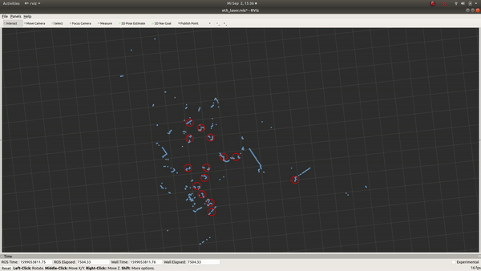

This repository contains the implementation of *DR-SPAAM: A Spatial-Attention and Auto-regressive Model for Person Detection in 2D Range Data* ([arXiv](https://arxiv.org/abs/2004.14079)).

# DR-SPAAM Detector
DR-SPAAM is a deep learning based person detector that detects persons in 2D range sequences obtained from a laser scanner.


Although DR-SPAAM is a detector, it can generate simple tracklets, based on its spatial similarity module.


To interface with many robotic applications, an example ROS node is also included.
The ROS node, `dr_spaam_ros` subscribes to the laser scan (`sensor_msgs/LaserScan`)
and publishes detections as `geometry_msgs/PoseArray`.
To use a different message defination, simply modify `_detections_to_ros_msg` 
method in `src/dr_spaam_ros/dr_spaam_ros.py`.



## Quick Start
We provide our complete training and eveluation code.
If you would like to re-run experiments and make changes to our code, you can start out with the following scripts.

First clone and install the repository.
```
git clone https://github.com/VisualComputingInstitute/DR-SPAAM-Detector.git
cd dr_spaam
python setup.py install
```

Download and put the [DROW dataset](https://github.com/VisualComputingInstitute/DROW) under `dr_spaam/data`.

Download the checkpoints from the release section and put them under `dr_spaam/ckpts`.

To measure the network inference time, run:
```
python bin/demo.py --time 
```

To visualize detections on an example sequence, run:
```
python bin/demo.py --dets
```

To visualize detections with tracklets, run:
```
python bin/demo.py --tracks
```

To train your own network, run:
```
python bin/train.py --cfg cfgs/dr_spaam.yaml
```

To evaluat a checkpoint, run:
```
python bin/eval.py --cfg cfgs/dr_spaam.yaml --ckpt ckpts/dr_spaam_e40.pth
```
(add `--val` to evaluate on the validation set)

Integrating DR-SPAAM into other python projects is easy. 
Here's a minimum example.
```python
import numpy as np
from dr_spaam.detector import Detector

# Detector class wraps up preprocessing, inference, and postprocessing for 
# DR-SPAAM. Set `original_drow=True` to use the original DROW model instead. 
# Use `stride` to skip scan points if faster inference speed is needed.
ckpt = 'path_to_checkpoint'
detector = Detector(ckpt, original_drow=False, gpu=True, stride=1)

# set angular grid (this is only required once)
ang_inc = np.radians(0.5)  # angular increment of the scanner
num_pts = 450  # number of points in a scan
detector.set_laser_spec(ang_inc, num_pts)

# inference
while True:
    scan = np.random.rand(num_pts)  # scan is a 1D numpy array with positive values
    dets_xy, dets_cls, instance_mask = detector(scan)  # get detection

    # confidence threshold
    cls_thresh = 0.4
    cls_mask = dets_cls > cls_thresh
    dets_xy = dets_xy[cls_mask]
    dets_cls = dets_cls[cls_mask]
```

## ROS node
We provide an example ROS node `dr_spaam_ros`. 
First install `dr_spaam` to your python environment.
Then compile the ROS package 
```
catkin build dr_spaam_ros
```

Modify the topics and the path to the pre-trained checkpoint at 
`dr_spaam_ros/config/` and launch the node using
```
roslaunch dr_spaam_ros dr_spaam_ros.launch
```

Use the following code to convert a sequence from a DROW dataset into a rosbag
```
python scripts/drow_data_converter.py --seq <PATH_TO_SEQUENCE> --output drow.bag
```

Use RViz to visualize the inference result.
A simple RViz config is located at `dr_spaam_ros/example.rviz`.

## Inference time
|        | AP<sub>0.3</sub> | AP<sub>0.5</sub> | FPS (RTX 2080 laptop) | FPS (Jetson AGX) |
|--------|------------------|------------------|-----------------------|------------------|
|DROW    | 0.638 | 0.659 | 95.8 | 24.8 |
|DR-SPAAM| 0.707 | 0.723 | 87.3 | 22.6 |

Note: In the original paper, we used a voting scheme for postprocessing.
In the implementation here, we have replaced the voting with a non-maximum suppression,
where two detections that are less than 0.5 m apart are considered as duplicates 
and the less confident one is suppressed.
Thus there is a mismatch between the numbers here and those shown in the paper.

## Citation
If you use DR-SPAAM in your project, please cite:
```BibTeX
@article{Jia2020DRSPAAM,
  title =   {{DR-SPAAM: A Spatial-Attention and Auto-regressive
              Model for Person Detection in 2D Range Data}},
  author =  {Dan Jia and Alexander Hermans and Bastian Leibe},
  journal = {arXiv:2004.14079},
  year =    {2020}
}
```
